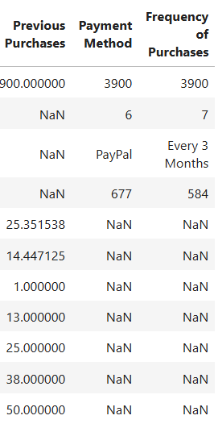
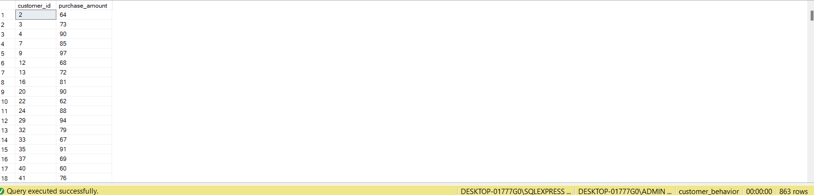
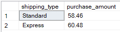
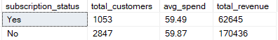
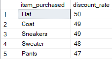
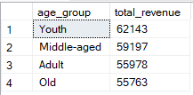

# Sam's Mart - Customer Behavior Analysis
End-to-end data analysis project - customer behavior analysis using Python, SQL, and PowerBI

# 1. Overview
This project explores how Sam’s Mart, a leading retail company, can leverage consumer shopping data to better understand customer behavior and enhance business performance. Using a comprehensive customer dataset, the analysis focuses on identifying key factors influencing purchasing patterns across demographics, product categories, and channels (online vs. offline).
The study investigates how elements such as discounts, product reviews, seasonal trends, and payment preferences affect customer engagement, conversion rates, and repeat purchases. Through data cleaning, exploratory data analysis (EDA), and visualization, the project uncovers actionable insights that can help Sam’s Mart:

 - Identify emerging shopping trends and customer segments
 - Optimize marketing and promotional strategies
 - Improve customer satisfaction and long-term loyalty
   
By transforming raw customer data into strategic insights, this project demonstrates the power of data analytics in shaping smarter retail decisions.

# 2. Dataset
- Rows: 3,900
- Columns: 18
- Key Features:
   - Customer demographics (Age, Gender, Location, Subscription Status)
   - Purchase details (Item Purchases, Category, Purchase Amount, Season, Size, Color)
   - Shopping behavior (Discount Applied, Promo Code Used, Previous Purchases, Frequency of Purchases, Review Rating, Shipping Type)
   - Missing Data: 37 values in Review Rating column

# 3. Tools
 - **Python** - Data Preparation & Modelling

Used for cleaning, transforming, and structuring raw customer data.

 - **SQL** - Data Analysis

Applied to organize and query the dataset, simulate business transactions, and extract insights on customer segmentation, loyalty patterns, and purchase behavior.

- **Power BI** - Visualization & Insights

Designed an interactive dashboard to visualize key performance metrics, shopping trends, and behavioral insights. The dashboard supports dynamic filtering and storytelling for business decision-making.

- **GitHub** - Version Control & Documentation

Serves as the central repository for all project files, including Python scripts, SQL queries, Power BI reports, and documentation. 

# 4. Exploratory Data Analysis using Python

I began with data preparation and cleaning in Python:
 - **Data Loading:** Imported the dataset using pandas.
 - **Initial Exploration:** Used df.info() to check structure and .describe() for summary statistics

- **Handling Missing Data:** Checked for null values and imputed missing values in the Review Rating column using the median rating of each product category.
- **Column Standardization:** Renamed columns to **snake case** for better readability and documentation.
- **Feature Engineering:**
   - Created **age_group** column by binning customer ages.
   - Created **purchase_frequency_days** column from purchase data.
- Data Consistency Check: Verified if **discount_applied** and **promo_code_used** were redudant; dropped **promo_code_used**.
- **Database Integration:** Connected Python script to MySQL and loaded the cleaned DataFrame into the database for SQL analysis.
# 5. Data Analysis using SQL (Business Transactions)
I performed structured analysis in Microsoft SQL Management Studio to answer key business questions:
1. **Revenue by Gender** - Compared total revenue generated by male vs. female customers.

   
   
   - Male customers generated more revenue as compared to female customers.
     
2. **High-Spending Discount Users** - Identified customers who used discounts but still spent above the average purchase amount.

   
   
   - 839 customers used discounts but still spent above the average purchase amount.
     
3. **Top 5 Products by Rating** - Found products with the highest average review ratings.

   
   
   - Gloves had the highest ratings with 3.86.
     
4. **Shipping Type Comparison** - Compared average purchase amounts between Standard and Express shipping.

   
   
   - Express shipping customers had higher average purchase amounts.
     
5. **Subscribers vs. Non-Subscribers** - Compared average spend and total revenue across subscription status.

   
   
   - There were more Non-Subscribers, spending on average more and generating more total revenue than Subscribers.
     
6. **Discount-Dependent Products** - Identified 5 products with the highest percentage of discounted purchases.

   
   
7. **Customer Segmentation** - Classified customers into New, Returning, and Loyal segments based on purchase history.

   
   
   - Based on the purchase history, Loyal customers were the most, followed by Returning customers while New customers were the least.
     
8. **Top 3 Products per Category** - Listed the most purchased products within each category.

   
   
9. **Repeat Buyers and Subscriptions** - Checked whether customers with more than 5 purchases are more likely to subscribe.

   
   
   - Customers with more than 5 purchases are less likely to subscribe.
     
10. **Revenue by Age Group** - Calculated total revenue contribution of each age group.

    
    
    - Young customers (Youth) generated the most revenue while Old customers generated the least revenue for Sam's Mart.
      
# 6. Dashboard in Power BI
# 7. Business Recommendations
# How to Run
